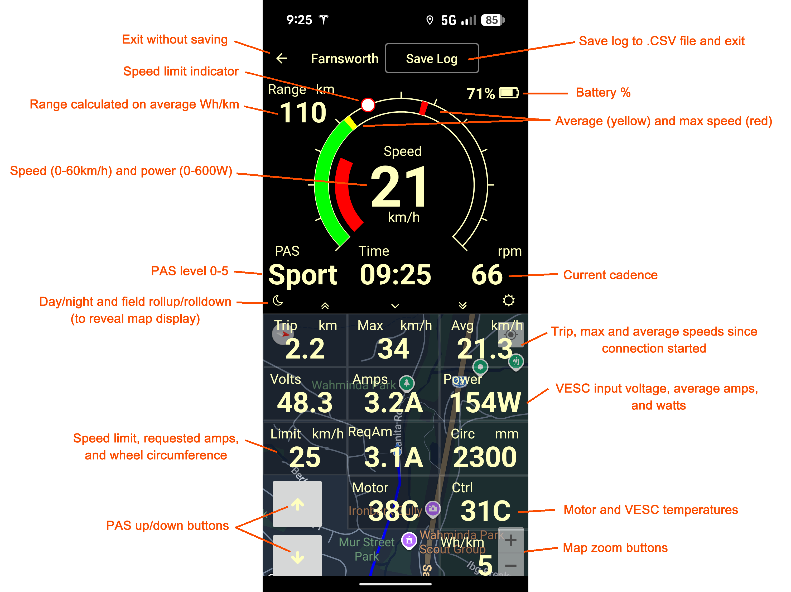

# Babelfish

## Android app branch only

The Babelfish Arduino project for Bafang CAN bus is no longer supported. It is preserved in the CANBus branch. This master branch is for the Android phone app only.

### BabelVESC

This version interfaces with [Farnsworth](https://github.com/gilesp1729/Farnsworth) to control a VESC by pedelec, using the Bafang M510 torque/cadence sensor (the analog version) and a speed sensor on the wheel. The phone app gives a display of motor status, speed and the like, and allows PAS level to be changed.

BabelVESC runs on late-model Android phones. It is written using B4A.

The services and characteristics used by BabelVESC are described as follows. A compatible peripheral (like Farnsworth) exposes a standard Cycle Power Service and a Battery Service, along with a custom service  containing VESC motor statistics. BabelVESC reads these wvery 500ms and displays them.

|                                                  |                                                                                 |
| ------------------------------------------------ | ------------------------------------------------------------------------------- |
| Service                                          | 0x1818 (Cycle Power Service)                                                    |
| Characteristic                                   | 0x2A63 (Cycle Power Measurement) 14 bytes                                       |
| byte 0, 1                                        | Flags =  0x30 (crank and wheel bytes present)                                   |
| byte 2, 3                                        | Power in watts                                                                  |
| byte 4-7                                         | Wheel revs cumulative  (4 bytes)                                             |
| byte 8, 9                                        | Wheel time in  half-milliseconds                                             |
| byte 10, 11                                      | Crank revs cumulative                                                           |
| byte 12, 13                                      | Crank time in  milliseconds                                                  |
| Characteristic                                   | 0x2A65 (Cycle Power Feature) 4 bytes                                            |
| byte 0                                           | Feature bits = 0x0C (crank and wheel  sensors)                               |
| byte 1, 2, 3                                     | Zero                                                                            |
| Characteristic                                   | 0x2A5D (Cycle Power Sensor Location) 1 byte                                     |
| byte 0                                           | Sensor location = 0x0B                                                          |
|                                                  |                                                                                 |
| Service                                          | 0x180F (Generic Battery Service)                                                |
| Characteristic  0x2A19 (Battery Level) 1 byte |                                                                                 |
| byte 0, 1                                        | Battery percentage                                                              |
|                                                  |                                                                                 |
| Service                                          | 0xFFF0 (Custom for BabelVESC)                                                   |
| Characteristic                                   | 0xFFF1 (Motor Measurement) 14 bytes                                             |
| byte 0, 1                                        | Speed in km/h * 100                                                             |
| byte 2                                           | Cadence in rpm                                                                  |
| byte 3, 4                                        | Power in watts                                                                  |
| byte 5, 6                                        | Battery volts * 100  (from VESC)                                             |
| byte 7, 8                                        | Motor amps * 100  (from VESC)                                                |
| byte 9, 10                                       | Requested motor amps  * 100 (to VESC)                                        |
| byte 11                                          | PAS level (not used  but left for compatibility)                             |
| byte 12                                          | Motor temp in degC +  40 (from VESC)                                         |
| byte 13                                          | Controller temp in  degC + 40 (from VESC)                                    |
| Characteristic                                   | 0xFFF2 (Motor Settings Readable) 7 bytes                                        |
| byte 0, 1                                        | Speed limit in km/h * 100                                                       |
| byte 2, 3                                        | Wheel circumference  in mm                                                   |
| byte 4                                           | PAS level (0-5)                                                                 |
| byte 5, 6                                        | Zero (left for  compatibility)                                               |
| Characteristic                                   | 0xFFF3 (Motor Settings Writable) 7 bytes                                        |
|                                                  | Same fields as for 0xFFF2. Writing to this will echo values back to  0xFFF2. |
